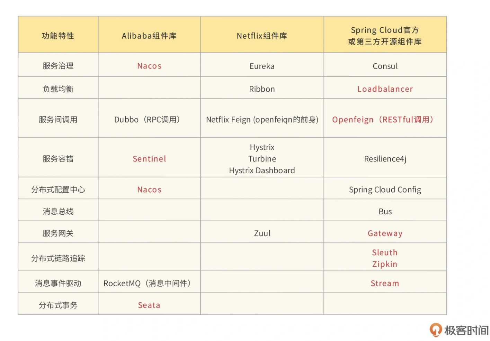
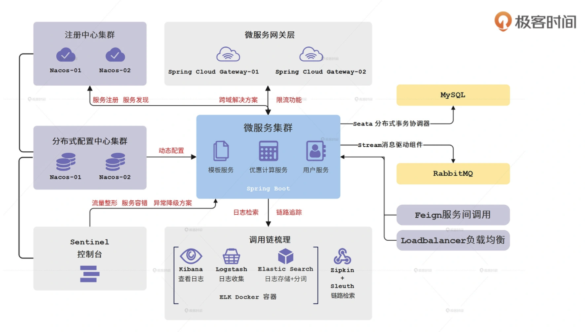

[TOC]


# 练手项目：优惠券模板服务

来自极客时间的 Spring Cloud 微服务项目实战的练手DEMO


## 开篇

### 如何学习

三大功能：

-   服务间通信，包括服务治理、负载均衡、服务间调用；
-   服务容错和异常排查，包括流量整形、降级熔断、调用链追踪；
-   分布式能力建设，包括微服务网关、分布式事务、消息驱动、分布式配置中心

两大特性：

-   高可用性
-   高可扩展性


### 学习姿势

-   多动手
-   尝试自己解决问题
-   不要死磕（记得复盘）

## 开始

### 微服务优势


-   快速迭代 + 快速回滚
-   资源利用大大提高
-   大幅降低协作成本
-   高可用
    -   弹性机房水位调拨
    -   流量整形
    -   熔断降级


### 本课程用到的全家桶组件



tips：尽量避免使用已经进入“维护状态”的组件


### 实战项目：优惠券


从 SpringBoot 进化成 Spring Cloud 项目：




## Spring Boot 落地

目录结构：

```
coupon-center
├── coupon-calculation-serv		// 计算服务
│   ├── coupon-calculation-api              // 存公共类或对外接口，提供一个“干净”的接口包给其它服务引用
│   ├── coupon-calculation-impl             // 核心业务逻辑
│   └── target
├── coupon-customer-serv		// 用户接口
│   ├── coupon-customer-api			
│   ├── coupon-customer-dao		    // 实体与DAO
│   └── coupon-customer-impl		
├── coupon-template-serv		// 优惠券模板服务
│   ├── coupon-template-api			
│   ├── coupon-template-dao			
│   └── coupon-template-impl		
├── middleware	                        // 平台类
└── 资源文件
```


