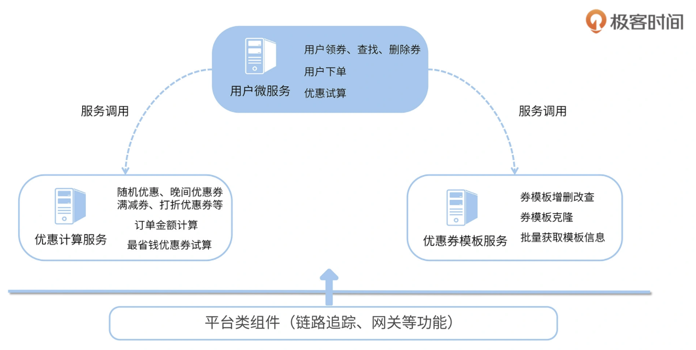

# 练手项目：优惠券模板服务

来自极客时间的 [Spring Cloud 微服务项目实战](https://gitee.com/banxian-yao/geekbang-coupon-center) 的练手DEMO

## 开篇

### 如何学习

三大功能：

-   服务间通信，包括服务治理、负载均衡、服务间调用；
-   服务容错和异常排查，包括流量整形、降级熔断、调用链追踪；
-   分布式能力建设，包括微服务网关、分布式事务、消息驱动、分布式配置中心

两大特性：

-   高可用性
-   高可扩展性

### 学习姿势

-   多动手
-   尝试自己解决问题
-   不要死磕（记得复盘）

## 开始

### 微服务优势

-   快速迭代 + 快速回滚
-   资源利用大大提高
-   大幅降低协作成本
-   高可用
    -   弹性机房水位调拨
    -   流量整形
    -   熔断降级

### 课程用到的全家桶组件

tips：尽量避免使用已经进入“维护状态”的组件

### 实战项目：优惠券应用

从 SpringBoot 进化成 Spring Cloud 项目：

