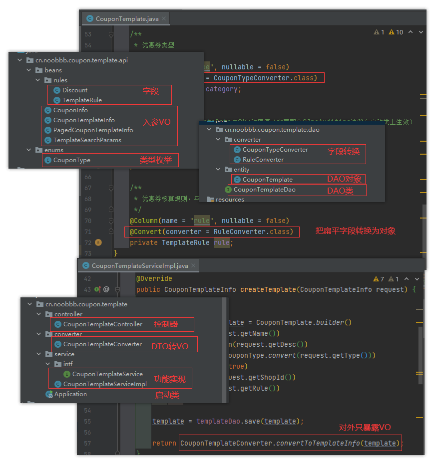

## Spring Boot 落地

### 目录结构

```
coupon-center
├── coupon-calculation-serv 	// 计算服务
│   ├── coupon-calculation-api		// 存公共类或对外接口，提供一个“干净”的接口包给其它服务引用
│   ├── coupon-calculation-impl		// 核心业务逻辑
├── coupon-customer-serv		// 用户接口
│   ├── coupon-customer-api			// 同上
│   ├── coupon-customer-dao			// 实体与DAO
│   └── coupon-customer-impl		// 同上
├── coupon-template-serv		// 优惠券模板服务
│   ├── coupon-template-api			// 同上
│   ├── coupon-template-dao			// 同上
│   └── coupon-template-impl		// 同上
├── middleware					// 平台类
└── 资源文件
```


**优惠券模板服务（coupon-template ）**




**计算服务（coupon-calculation）**


**用户接口（coupon-customer）**


>之所以划分为3个模块，是为了区分：计算密集型服务与 IO/ 存储密集型服务
>
>
>这里用户端直接调用到其他2个模块，可以只启动用户端，相当于一个大单体应用

