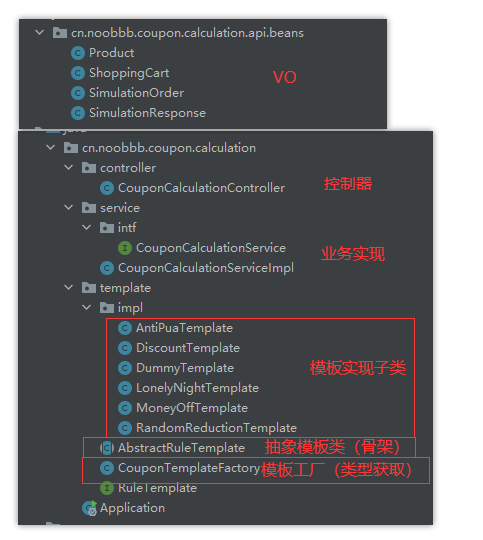
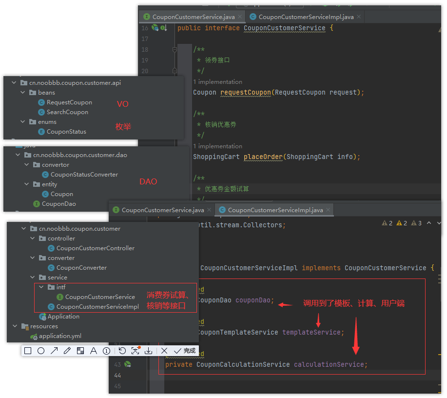
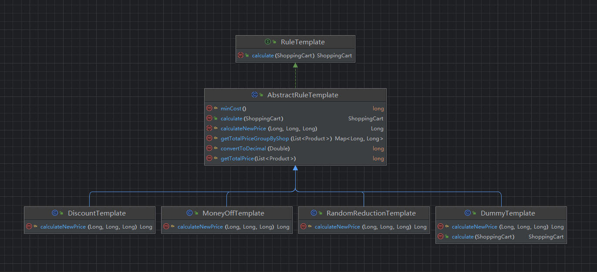

## Spring Boot 落地

### 目录结构

```shell
coupon-center
├── coupon-calculation-serv 	// 计算服务
│   ├── coupon-calculation-api		// 存公共类或对外接口，提供一个“干净”的接口包给其它服务引用
│   ├── coupon-calculation-impl		// 核心业务逻辑
├── coupon-customer-serv		// 用户接口
│   ├── coupon-customer-api			
│   ├── coupon-customer-dao			// 实体与DAO
│   └── coupon-customer-impl		
├── coupon-template-serv		// 优惠券模板服务
│   ├── coupon-template-api			
│   ├── coupon-template-dao			
│   └── coupon-template-impl		
├── middleware					// 平台类
└── 资源文件
```

### 优惠券模板服务（coupon-template）


### 计算服务（coupon-calculation）



### 用户接口（coupon-customer）



>[!tips]
>
>之所以划分为 3 个模块，是为了区分不同类型服务，可以根据不同类型资源需要进行扩容：
>
>- 计算密集型服务
>- IO 存储密集型服务

>[!tips]
>
>这里用户端直接调用到其他 2 个模块，可以只启动用户端，相当于一个大单体应用

### 其他细节

#### Maven 依赖项配置

`pom.xml` 示例：

```xml
	<!-- 父项 ，如果父项pom文件不在上级文件夹，则需要设置 relativePath -->
    <parent>        
	    <groupId>org.springframework.boot</groupId>  
        <artifactId>spring-boot-starter-parent</artifactId>  
        <version>3.2.4</version> 
    </parent>  
  
    <groupId>cn.noobbb</groupId>  
    <artifactId>coupon-center</artifactId>  
    <version>1.0-SNAPSHOT</version>  
    <packaging>pom</packaging> <!-- 表示不包含具体实现，只充当整合 -->  
  
    <name>coupon-center</name>  
    <description>优惠券中心</description>  
    
	<!-- 子项 -->
    <modules>        
	    <module>coupon-template-serv</module>  
        <module>coupon-calculation-serv</module>  
        <module>coupon-customer-serv</module>  
    </modules>  
  
    <!-- dependencyManagement 定义为父级依赖，可将版本向下传递 -->  
    <dependencyManagement>  
        <dependencies>  
            <dependency>  
                <groupId>mysql</groupId>  
                <artifactId>mysql-connector-java</artifactId>  
                <version>8.0.33</version>  <!-- 可将版本向下传递 -->  
            </dependency>  
			  ...
        </dependencies>  
    </dependencyManagement>  
  
    <properties>       
		<java.version>21</java.version>  
    </properties>  
</project>
```

#### 防御型编程

```java
@Getter
@AllArgsConstructor
public enum CouponType {
    // UNKNOWN tips: 防御性编程，用来应对错误的code
    UNKNOWN("unknown", "0"),
    MONEY_OFF("满减券", "1"),
    DISCOUNT("打折", "2"),
    RANDOM_DISCOUNT("随机减", "3"),
    LONELY_NIGHT_MONEY_OFF("晚间双倍优惠券", "4"),
    ANTI_PUA("PUA加倍奉还券", "5");

    private final String description;
    private final String code;

    public static CouponType convert(String s) {
        return Stream.of(values())
                .filter(couponType -> couponType.code.equalsIgnoreCase(s))
                .findFirst()
                .orElse(UNKNOWN);
    }
}
```

#### Lomkob 注解自动生成代码

```java
@Builder
@Data
@NoArgsConstructor
@AllArgsConstructor
@Entity
```

 [Lomkob 官网](https://projectlombok.org/) 、 [Lomkob 官网 图文教程](https://objectcomputing.com/resources/publications/sett/january-2010-reducing-boilerplate-code-with-project-lombok)

#### jakarta.validate-api 组件

如果请求参数校验不通过，接口会自动返回 Bad Request 异常。

```java
public class ShoppingCart {  
    @NotEmpty  
    private List<Product> products;  
	@NotNull  
    private Long userId;  
}
```

#### spring-data-jpa 组件

##### ORM

```java
@Entity
@Builder
@EntityListeners(AuditingEntityListener.class)
@Table(name = "coupon_template")
public class CouponTemplate implements Serializable {

    @Id
    @GeneratedValue(strategy = GenerationType.IDENTITY)
    @Column(name = "id", nullable = false)
    private Long id;

    // 创建时间，通过@CreateDate注解自动填值
    //（需要配合@JpaAuditing注解在启动类上生效）
    @CreatedDate
    @Column(name = "created_time", nullable = false)
    private Date createdTime;

    // 优惠券类型
    @Column(name = "type", nullable = false)
    @Convert(converter = CouponTypeConverter.class)
    private CouponType category;

    // 优惠券核算规则，平铺成JSON字段
    @Column(name = "rule", nullable = false)
    @Convert(converter = RuleConverter.class)
    private TemplateRule rule;
}
```

```java
@Converter
public class CouponTypeConverter implements AttributeConverter<CouponType, String> {
    @Override
    public String convertToDatabaseColumn(CouponType couponCategory) {
        return couponCategory.getCode();
    }
    @Override
    public CouponType convertToEntityAttribute(String code) {
        return CouponType.convert(code);
    }
}
```

这里运用了 `javax.persistence` 包和 `Spring JPA` 包的标准注解，对数据库字段进行了映射。

- `Entity`：声明了“数据库实体”对象；
- `Table`：指定了对应的数据库表的名称；
- `ID/GeneratedValue`：ID 注解将某个字段定义为唯一主键，GeneratedValue 注解指定了主键生成策略；
- `Column`：指定了每个类属性和数据库字段的对应关系，该注解还支持非空检测、对 update 和 create 语句进行限制等功能；
- `CreatedDate`：自动填充当前数据的创建时间；
- `Convert`：如果数据库中存放的是 code、string、数字等等标记化对象，可以使用 Convert 注解指定一个继承自 `AttributeConverter` 的类，将 DB 里存的内容转化成一个 Java 对象。

也支持 ManyToOne、OneToOne 等注解，但建议**尽可能减少级联配置，用单表查询取而代之**。

##### Spring Data

```java
public interface CouponTemplateDao extends JpaRepository<CouponTemplate, Long> {

    // JPA 约定大于配置：<起手式>By<查询字段><连接词>
    List<CouponTemplate> findAllByShopId(Long shopId);

    // IN查询 + 分页支持的语法
    Page<CouponTemplate> findAllByIdIn(List<Long> Id, Pageable page);

    // 通过接口名查询
    Integer countByShopIdAndAvailable(Long shopId, Boolean available);

    // JPA 自定义SQL
    @Modifying
    @Query("update CouponTemplate c set c.available = false where c.id = :id")
    int makeCouponUnavailable(@Param("id") Long id);
}

// Example 查询的方式
// 构造一个 CouponTemplate 的对象，将你想查询的字段值填入其中，做成一个查询模板，调用 Dao 层的 findAll 方法即可
@Override  
public PagedCouponTemplateInfo search(TemplateSearchParams request) {  
	// 封装查询模板
    CouponTemplate example = CouponTemplate.builder()  
            .shopId(request.getShopId())  
            .category(CouponType.convert(request.getType()))  
            .available(request.getAvailable())  
            .name(request.getName())  
            .build();  

	//  分页
    Pageable page = PageRequest.of(request.getPage(), request.getPageSize());  
    
    Page<CouponTemplate> result = templateDao.findAll(Example.of(example), page);  
    List<CouponTemplateInfo> couponTemplateInfos = result.stream()  
            .map(CouponTemplateConverter::convertToTemplateInfo)  
            .toList();  
  
    return PagedCouponTemplateInfo.builder()  
            .templates(couponTemplateInfos)  
            .page(request.getPage())  
            .total(result.getTotalElements())  
            .build();  
}
```

- **通过接口名查询**：
	- 将查询语句写到接口的名称中
	- 起手式 `< 起手式 >By< 查询字段 >< 连接词 >`
- **通过 Example 对象查询**：
	- 构造一个模板对象，使用 `findAll` 方法来查询
- **自定义查询**：
	- 通过 Query 注解自定义复杂查询语句

#### 模板设计模式

用模板设计模式封装计算逻辑，**就是将共性的算法骨架部分上升到抽象层，将个性部分延迟到子类中去实现**。



#### Spring Boot 启动类

```java
@SpringBootApplication // 自动开启包路径扫描，并启动一系列的自动装配流程（AutoConfig）
@EnableJpaAuditing // 注解自动填值
@EnableTransactionManagement // 事务管理器
@ComponentScan(basePackages = {"com.xxx"})  // 用于扫描组件
@EnableJpaRepositories(basePackages = {"com.xxx"}) // 用于扫描Dao（@Repository）
@EntityScan(basePackages = {"com.xxx"}) // 用于扫描JPA实体类（@Entity）
public class Application {
    public static void main(String[] args) {
        SpringApplication.run(Application.class, args);
    }
}
```
