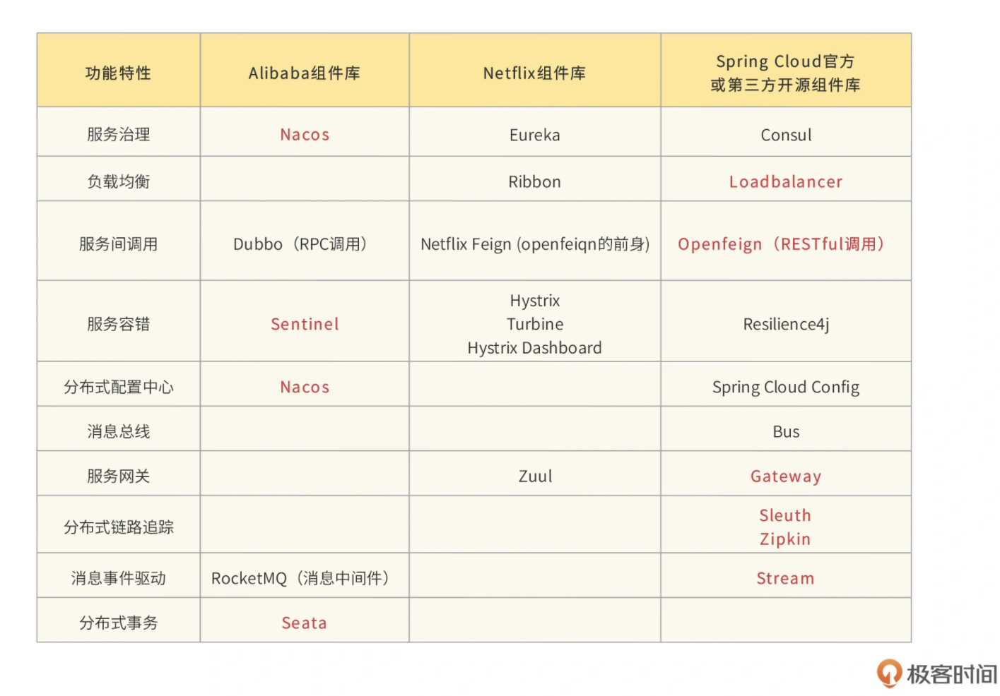
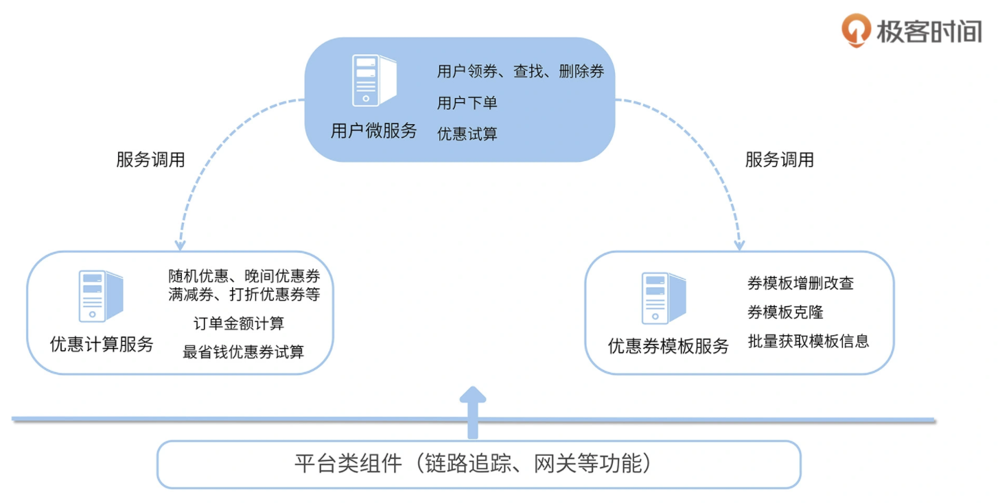
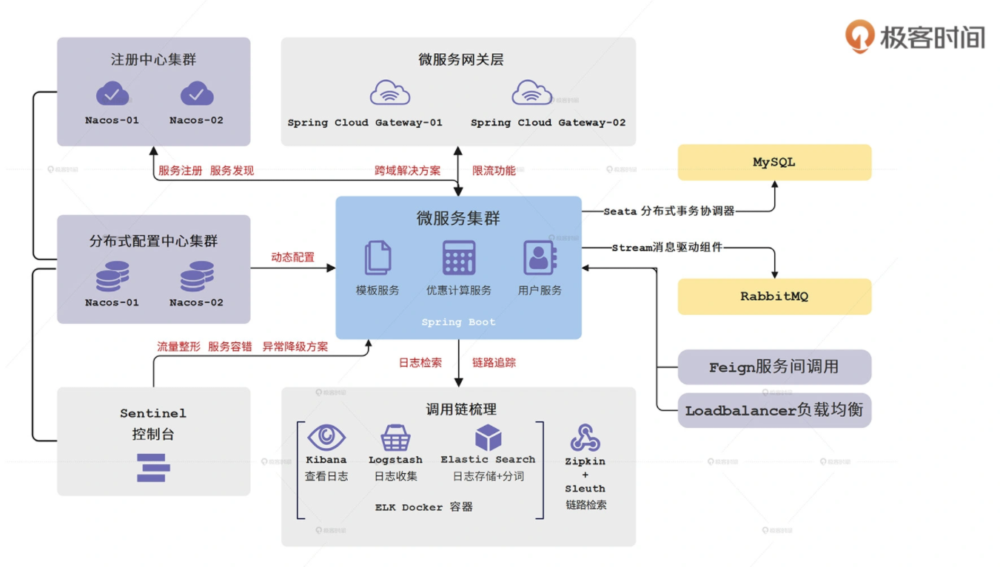
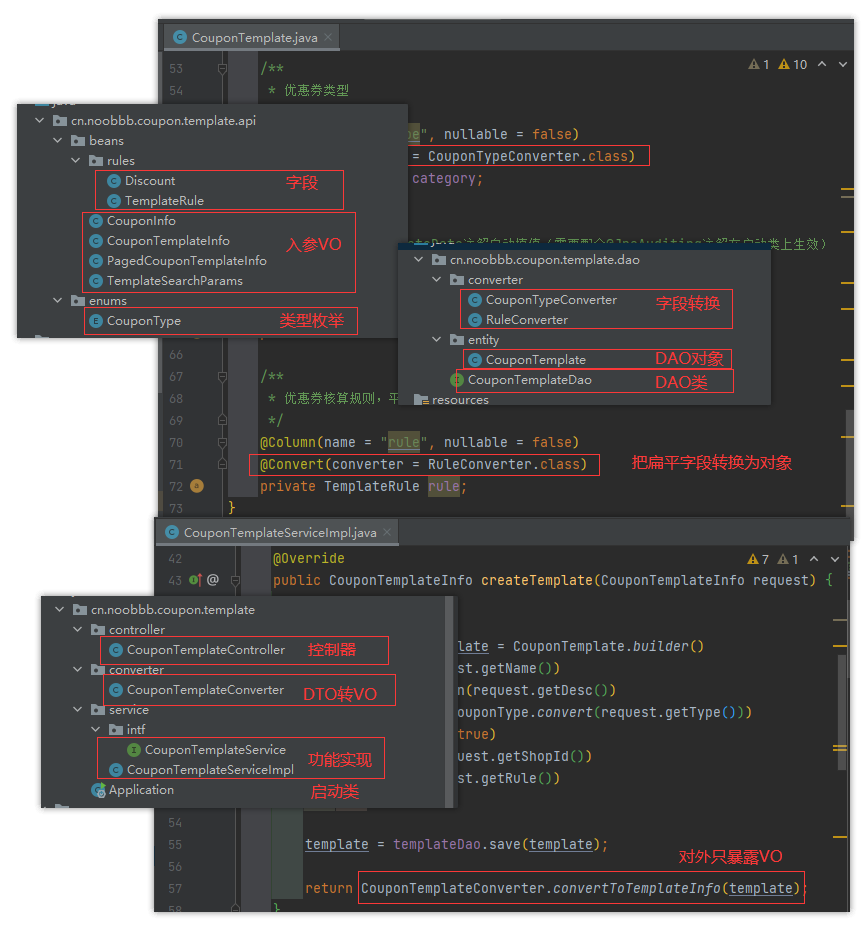
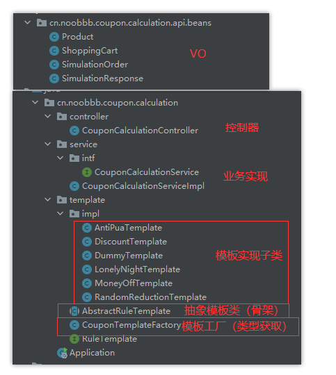
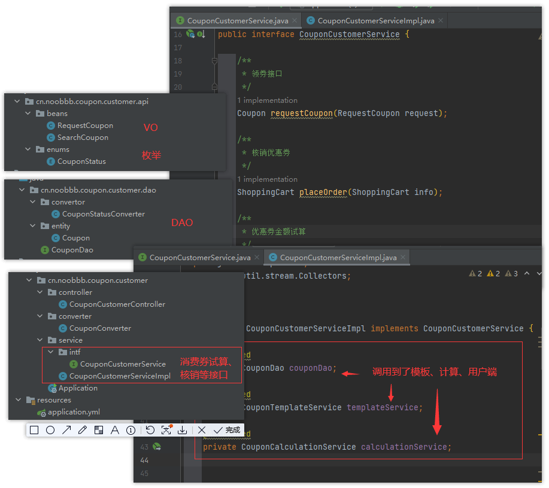
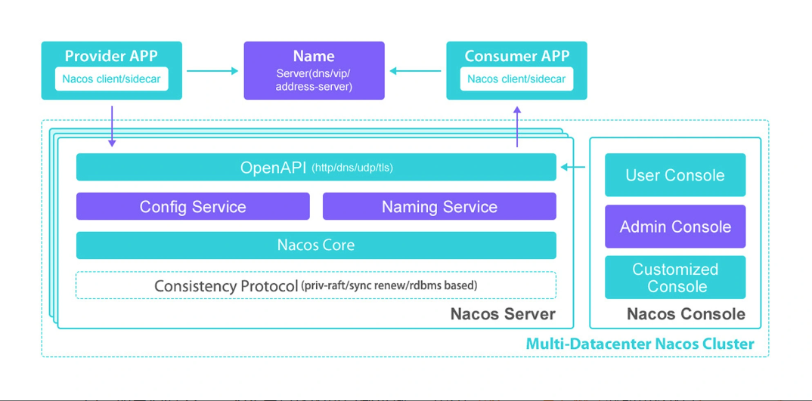
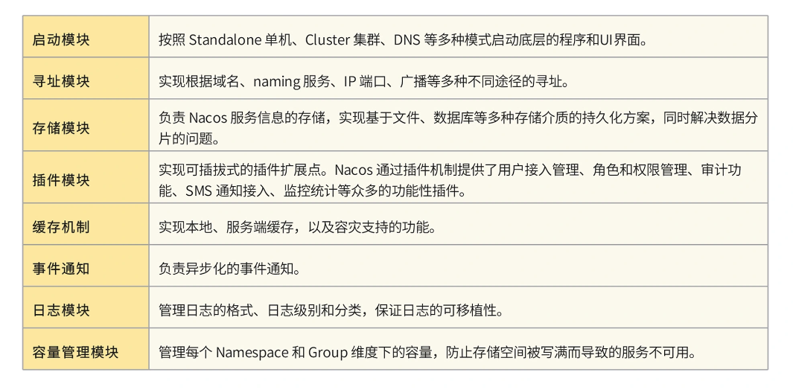
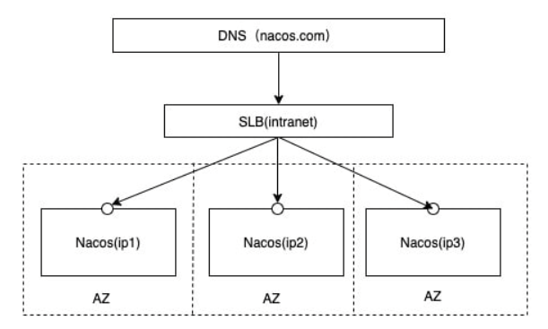

[TOC]

# 练手项目：优惠券模板服务

来自极客时间的 [Spring Cloud 微服务项目实战](https://gitee.com/banxian-yao/geekbang-coupon-center) 的练手DEMO


## 开篇

### 如何学习

三大功能：

-   服务间通信，包括服务治理、负载均衡、服务间调用；
-   服务容错和异常排查，包括流量整形、降级熔断、调用链追踪；
-   分布式能力建设，包括微服务网关、分布式事务、消息驱动、分布式配置中心

两大特性：

-   高可用性
-   高可扩展性


### 学习姿势

-   多动手
-   尝试自己解决问题
-   不要死磕（记得复盘）


## 开始

### 微服务优势

-   快速迭代 + 快速回滚
-   资源利用大大提高
-   大幅降低协作成本
-   高可用
    -   弹性机房水位调拨
    -   流量整形
    -   熔断降级


### 课程用到的全家桶组件



tips：尽量避免使用已经进入“维护状态”的组件


### 实战项目：优惠券应用





从 SpringBoot 进化成 Spring Cloud 项目：



## Spring Boot 落地

### 目录结构

```
coupon-center
├── coupon-calculation-serv 	// 计算服务
│   ├── coupon-calculation-api		// 存公共类或对外接口，提供一个“干净”的接口包给其它服务引用
│   ├── coupon-calculation-impl		// 核心业务逻辑
├── coupon-customer-serv		// 用户接口
│   ├── coupon-customer-api			// 同上
│   ├── coupon-customer-dao			// 实体与DAO
│   └── coupon-customer-impl		// 同上
├── coupon-template-serv		// 优惠券模板服务
│   ├── coupon-template-api			// 同上
│   ├── coupon-template-dao			// 同上
│   └── coupon-template-impl		// 同上
├── middleware					// 平台类
└── 资源文件
```


**优惠券模板服务（coupon-template ）**




**计算服务（coupon-calculation）**




**用户接口（coupon-customer）**




>
>   之所以划分为3个模块，是为了区分：计算密集型服务与 IO/ 存储密集型服务
>   
>
>   这里用户端直接调用到其他2个模块，可以只启动用户端，相当于一个大单体应用


##  Spring Cloud 基础


### 服务治理


#### 原理

-   服务注册：应用启动后主动注册到注册中心
-   服务发现：应用推or拉，获取服务列表与变动
-   服务调用：根据负载均衡策略，选取一个服务节点发起调用
-   异常容错：通过探活机制来标记异常服务，进行剔除，被动下线（或者应用主动下线）


#### Nacos

服务**领域模型：**

-   **服务**
    -   配置元数据和服务保护阈值（保证最低可用限度）等信息
-   **集群**
    -   配置元数据
    -   持久化节点：主动探活
    -   临时节点（默认）：节点主动发送心跳报备状态
-   **实例**
    -   配置元数据、修改上下线状态、配置路由权重等


**数据模型：**

-   **Namespace**
    -   命名空间，可以用来区分环境或租户隔离，服务默认归属 "public"
-   **Group**
    -   分组，不同分组互相隔离，服务默认归属 "DEFAULT_GROUP"
-   **Service/DataID**
    -   具体微服务

可以通过 Namespace + Group + Service/DataID 精准定位到一个具体的微服务


**基本架构：**

-   **Naming Service**
    -   服务发现
-   **Config Service**
    -   配置项管理、动态更新配置、元数据




**Nacos Core 模块**




**一致性协议**

一致性协议用来确保 Nacos 集群中各个节点之间的数据一致性， Nacos 支持两种一致性协议：

-   Raft 协议：侧重一致性
-   Distro 协议：侧重可用性（最终一致性）


### 搭建 Nacos 服务注册中心


**如何保障系统的高可用**

-   避免单点故障
-   故障机器状态恢复


Nacos 通过集群的方式解决以上2个问题


#### 搭建 Nacos docker 集群


1.   创建数据库 Schema：nacos

     ```sql
     create schema nacos;
     ```

2.   运行 [nacos 官方初始化sql脚本](https://github.com/alibaba/nacos/blob/develop/distribution/conf/nacos-mysql.sql) 

3.   创建 docker 容器集群：

     注：如果不用 docker 的话，配置文件位于 conf/application.properties

     ```shell
     # nacos-cluster1  
     # 这里只列出了nacos1，端口为8848，其他两个端口为8948与8748，配置除了改端口和名字外一模一样
     
     docker run -d \
      -e PREFER_HOST_MODE=hostname \
      -e MODE=cluster \
      -e NACOS_APPLICATION_PORT=8848 \
      -e NACOS_SERVERS="你的内网IP:8848 你的内网IP:8948 你的内网IP:8748" \
      -e SPRING_DATASOURCE_PLATFORM=mysql \
      -e MYSQL_SERVICE_HOST=你的内网IP \
      -e MYSQL_SERVICE_PORT=3306 \
      -e MYSQL_SERVICE_USER=root \
      -e MYSQL_SERVICE_PASSWORD=5233 \
      -e MYSQL_SERVICE_DB_NAME=nacos \
      -e NACOS_SERVER_IP=你的内网IP \
      -p 8848:8848 \
      --restart=always \
      --name nacos1 \
      nacos/nacos-server:v2.1.0
     ```

     docker log ：

     ```
     2022-07-31 17:40:33,540 INFO Nacos is starting...
     2022-07-31 17:40:34,298 INFO Nacos started successfully in cluster mode. use external storage   
     // 表示成功运行集群模式，使用外置存储
     // 如果无法启动，可以查看/logs/start.out具体报错信息，可以先排查是否端口占用或连不上mysql
     ```


4.   登录控制台查看界面，默认账号密码为nacos：

     http://你的内网IP:8848/nacos


#### 推荐的部署架构：

常见做法：提供一个 Virtual IP 给到 Client，例如 LVS、SLB、Nginx、keepalived 等技术




### 集成 Nacos


